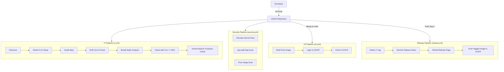
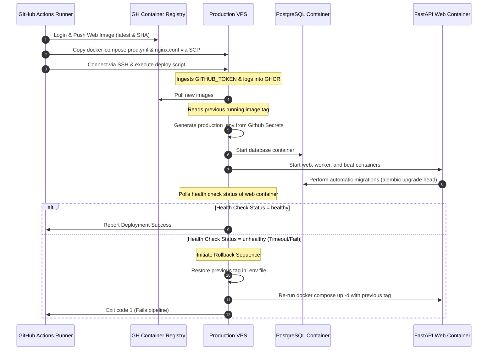

# Deployment Architecture & Playbook

This document details the production architecture, local development setup, CI/CD pipelines, VPS deployment playbook, and troubleshooting guide for the **Currency Tracker Platform**.

---

## 1. Directory Structure

### Project Codebase Structure
The project's codebase layout is structured as follows:
```text
currency-exchange/
├── .github/
│   └── workflows/
│       ├── ci.yml            # CI Pipeline (Linter, Formatter, Pytest, Docker build check)
│       ├── cd.yml            # CD Pipeline (Build prod, Push, Deploy to VPS, Auto-rollback)
│       ├── security.yml      # Security scanning (Gitleaks, pip-audit, Trivy image scan)
│       └── release.yml       # Release pipeline (SemVer tagging, Github Release creation)
├── alembic/                  # Database migrations (Alembic)
├── app/                      # Application source code
│   ├── core/                 # Core configs, database setup, logging, redis, dependencies
│   ├── modules/              # Domain-driven features (auth, users, currency, health)
│   ├── tasks/                # Task broker and scheduler registrations
│   └── main.py               # FastAPI entrypoint
├── docker/
│   ├── beat.sh               # Taskiq scheduler runner script
│   ├── celery.sh             # Taskiq background worker runner script
│   ├── entrypoint.sh         # Dependency waiter & automatic migrations script
│   ├── nginx.conf            # Production Nginx reverse proxy configuration (HTTPS/SSL)
│   ├── nginx.dev.conf        # Development Nginx reverse proxy configuration (HTTP port 80)
│   └── start.sh              # FastAPI Web App runner script
├── tests/                    # Pytest test suite
├── .dockerignore             # Excludes files from docker build context
├── .env.example              # Configuration template
├── alembic.ini               # Alembic config
├── Dockerfile                # Multi-stage production Dockerfile
├── docker-compose.yml        # Development docker-compose
├── docker-compose.prod.yml   # Production docker-compose (no bind mounts, secure defaults)
├── pyproject.toml            # Python tools config (Black, Ruff, Pytest)
└── requirements.txt          # Python dependencies list
```

### Production VPS Directory Structure
On the production Linux VPS, the services run within `/app/currency-tracker`:
```text
/app/currency-tracker/
├── docker/
│   └── nginx.conf            # Copied by CD from the repo (Read-Only mount in Nginx)
├── .env                      # Production env secrets (managed on host/injected by CD)
└── docker-compose.prod.yml   # Copied by CD from the repo
```

---

## 2. CI/CD Architecture Diagram

This diagram displays how code changes trigger the pipelines, build images, audit security, and push artifacts.



---

## 3. Production Deployment Flow Diagram

This diagram outlines how the CD pipeline deploys to the remote Linux VPS and executes health checks with auto-rollback mechanisms.



---

## 4. Local Development Workflow

Developers run the application locally using Docker Compose, which supports hot-reloading for code modifications and maps debug ports.

### Commands to Run Locally

1. **Spin up local development infrastructure:**
   ```bash
   # Build images and start all containers in the background
   docker compose up --build -d
   ```

2. **Inspect running services:**
   ```bash
   docker compose ps
   ```

3. **View logs from all containers or a specific container:**
   ```bash
   # All containers
   docker compose logs -f
   
   # FastAPI web container
   docker compose logs -f web
   
   # Taskiq worker container
   docker compose logs -f celery_worker
   ```

4. **Verify container health checks:**
   ```bash
   docker inspect --format='{{json .State.Health}}' currency_tracker_web
   ```

5. **Stop and clean up containers (retaining volumes):**
   ```bash
   docker compose down
   ```

6. **Reset local environment (purging DB & Redis volumes):**
   ```bash
   docker compose down -v
   ```

---

## 5. Production Deployment Playbook

### Initial Server Preparation (One-Time Setup on VPS)

1. **Install Docker and Docker Compose:**
   ```bash
   sudo apt-get update
   sudo apt-get install -y docker.io docker-compose-plugin
   sudo systemctl enable --now docker
   ```

2. **Establish the deployment directory and permissions:**
   ```bash
   sudo mkdir -p /app/currency-tracker/docker
   sudo chown -R $USER:$USER /app/currency-tracker
   ```

3. **Configure SSH key access for GitHub Actions:**
   - Generate a keypair on your local machine: `ssh-keygen -t ed25519 -C "vps-deploy"`
   - Append the public key to `/home/username/.ssh/authorized_keys` on the VPS.
   - Add the private key to the GitHub Repository Secrets as `VPS_SSH_KEY`.
   - Add the VPS IP address as `VPS_IP` and SSH username as `VPS_SSH_USER`.

4. **Prepare SSL Certificates:**
   - In production, mount your Let's Encrypt certificates to `/var/lib/docker/volumes/currency-exchange_letsencrypt_certs/_data/live/localhost/`.
   - If using a domain, update `localhost` in Nginx and compose files to `yourdomain.com`.
   - To acquire initial certs:
     ```bash
     docker run -it --rm --name certbot \
       -v "/app/currency-tracker/letsencrypt:/etc/letsencrypt" \
       -v "/app/currency-tracker/certbot_www:/var/www/certbot" \
       certbot/certbot certonly --webroot \
       -w /var/www/certbot -d yourdomain.com
     ```

### Production Deployment Command Sequence
The deployment is entirely automated by the GitHub Actions CD pipeline. To trigger a deployment:
1. Merge tested code into the `main` branch.
2. The GitHub Action will run, build, and deploy.

#### Manual Production Deployment (Fallback)
If GitHub Actions is unavailable, execute these steps directly on the VPS:
```bash
# 1. SSH into the VPS
ssh username@vps_ip

# 2. Navigate to deployment folder
cd /app/currency-tracker

# 3. Pull latest code (if git clone is used) or edit files
# 4. Pull latest docker images from GHCR
docker compose -f docker-compose.prod.yml pull

# 5. Build and restart services
docker compose -f docker-compose.prod.yml up -d --remove-orphans
```

---

## 6. Maintenance & Updates

### Database Migrations
Migrations are executed automatically on startup of the `web` container.
- If you add a new model or field locally, generate a migration script:
  ```bash
  docker compose exec web alembic revision --autogenerate -m "add_new_column"
  ```
- Since the `./alembic` folder is bind-mounted locally, the generated migration script is saved directly to your local codebase. Commit it, and the CD pipeline will deploy and apply it automatically.

### Rolling Back Deployments
The CD pipeline performs auto-rollback if a health check fails. If you need to trigger a manual rollback to a specific version:
```bash
# 1. SSH to VPS
cd /app/currency-tracker

# 2. Edit .env and change IMAGE_TAG to the desired git commit SHA or version tag
# Example: IMAGE_TAG=4f5g6h7
nano .env

# 3. Apply changes (Docker will swap only the containers whose image tag changed)
docker compose -f docker-compose.prod.yml up -d
```

---

## 7. Troubleshooting Guide

### 1. Web Container Fails to Start (CrashLoopBackOff)
- **Check logs:**
  ```bash
  docker compose logs web
  ```
- **Cause: DB/Redis connection timed out.** The entrypoint script waits for 90 seconds. If PostgreSQL or Redis takes longer, the check fails. Check if the database is running:
  ```bash
  docker compose ps db redis
  ```
- **Cause: Migration lock/conflict.** If two migrations run at once or there's a database lock, Alembic will fail. Clean the database state or manually resolve using:
  ```bash
  docker compose exec db psql -U postgres -d currency_tracker -c "select * from alembic_version;"
  ```

### 2. Redis/PostgreSQL Connection Failures in FastAPI
- Confirm you are using the service hostname `db` and `redis` in the environment settings inside containers, rather than `localhost`.
- Check if they are on the same docker network:
  ```bash
  docker network inspect currency-exchange_app_network
  ```

### 3. Nginx Gateway Timeout (504) or Bad Gateway (502)
- Check that the FastAPI container is running and healthy:
  ```bash
  docker compose ps web
  ```
- Ensure the hostname matched in `nginx.conf` upstream (`web:8000`) is correct.
- View proxy access/error logs:
  ```bash
  docker compose logs nginx
  ```

### 4. WebSockets Disconnecting Immediately
- WebSocket connections require Nginx to upgrade the HTTP connection. Verify that the Nginx configuration maps the `$http_upgrade` and `$connection_upgrade` variables correctly (implemented in `docker/nginx.conf`).
- Ensure proxy timeout settings (`proxy_read_timeout` and `proxy_send_timeout`) are set high (currently set to `3600s` for persistent connections).

### 5. Rate Limiting Triggering unexpectedly (429 Too Many Requests)
- Nginx restricts clients to `10r/s` with a burst of `20`. If your application makes rapid concurrent requests, raise the limit in `nginx.conf` by adjusting `rate=10r/s` to a higher value (e.g. `rate=30r/s`), then reload Nginx:
  ```bash
  docker compose exec nginx nginx -s reload
  ```
