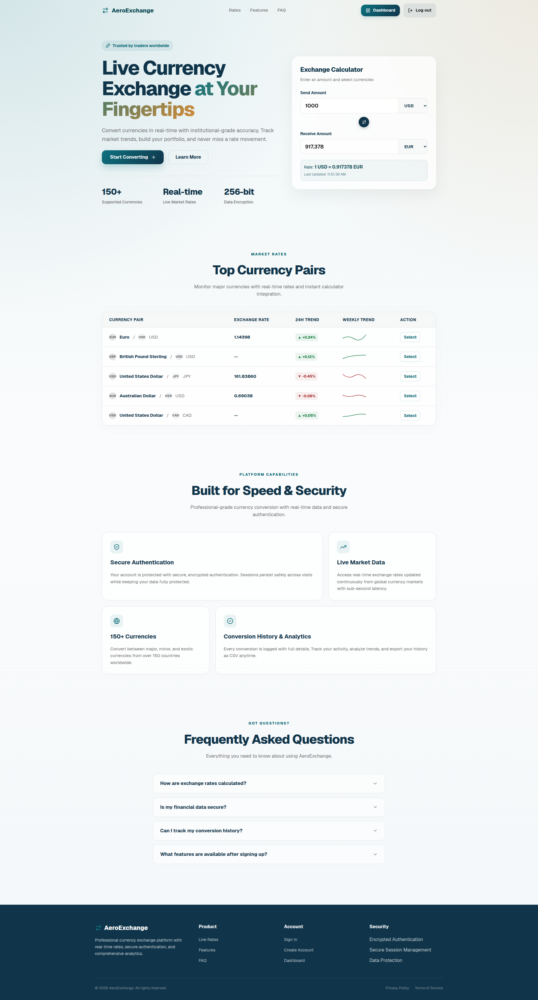
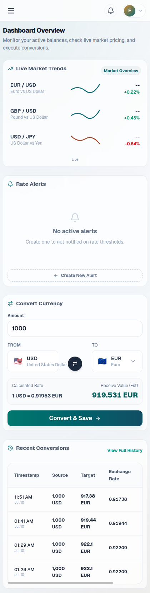

<div align="center">

# AeroExchange

### Live Currency Exchange at Your Fingertips

[](https://github.com/your-username/currency-exchange/actions/workflows/ci.yml)
[](https://github.com/your-username/currency-exchange/actions/workflows/cd.yml)
[](https://github.com/your-username/currency-exchange/actions/workflows/security.yml)
[](LICENSE)

Convert currencies in real-time with institutional-grade accuracy. Track market trends, build your portfolio, and never miss a rate movement.

[Live Demo](https://aero-exchange.vercel.app) · [API Docs](https://currency-exchnage.onrender.com/docs) · [Report Bug](https://github.com/your-username/currency-exchange/issues)

</div>

---

## Preview

<p align="center">
  
</p>

<p align="center">
  
</p>

---

## Why AeroExchange?

| | Feature | Description |
|---|---------|-------------|
| :zap: | **Real-time Streaming** | WebSocket-powered live rates pushed every 5 seconds |
| :globe_with_meridians: | **150+ Currencies** | Major, minor, and exotic currencies from around the world |
| :chart_with_upwards_trend: | **Analytics Dashboard** | Historical trends, percentage changes, and conversion statistics |
| :bell: | **Rate Alerts** | Get notified via email when rates cross your thresholds |
| :star: | **Favorites** | Save and track your preferred currency pairs |
| :shield: | **Bank-grade Security** | JWT + Refresh Token Rotation, bcrypt hashing, 256-bit encryption |
| :bookmark: | **Conversion History** | Full audit trail with CSV export and advanced filtering |
| :iphone: | **Fully Responsive** | Seamless experience across desktop, tablet, and mobile |

---

## Tech Stack

### Backend

| | Technology |
|---|------------|
| Framework |  |
| Language |  |
| Database |  |
| Cache |  |
| Task Queue |  |
| ORM | SQLAlchemy 2.0 (async) |
| Migrations | Alembic |
| Auth | JWT + Refresh Token Rotation |

### Frontend

| | Technology |
|---|------------|
| Framework |  |
| Language |  |
| Build |  |
| Styling |  |
| UI | shadcn/ui + Lucide Icons |
| State | TanStack React Query |
| Charts | Recharts |
| Forms | React Hook Form + Zod |

### Infrastructure

| | Technology |
|---|------------|
| Containers |  |
| CI/CD |  |
| Proxy |  |
| Backend Host |  |
| Frontend Host |  |

---

## Architecture

```
currency-exchange/
├── app/
│   ├── core/               # Config, database, Redis, logging, security
│   ├── modules/
│   │   ├── auth/           # Registration, login, JWT, refresh tokens
│   │   ├── currency/       # Rates, conversion, analytics, favorites
│   │   └── notifications/  # Email alerts, daily summaries
│   ├── tasks/              # Celery tasks & beat schedule
│   ├── static/             # Swagger UI assets
│   └── main.py             # FastAPI app factory + lifespan
├── alembic/                # Database migrations
├── frontend/               # React + Vite + TypeScript
│   ├── src/
│   │   ├── components/     # Reusable UI components
│   │   ├── pages/          # Route pages
│   │   ├── hooks/          # Custom React hooks
│   │   ├── lib/            # API client, utilities
│   │   └── types/          # TypeScript definitions
│   └── public/             # Static assets & mockups
├── docker/                 # Entrypoint scripts
├── docker-compose.yml      # Dev environment
├── docker-compose.prod.yml # Production environment
├── render.yaml             # Render deployment blueprint
├── .github/workflows/      # CI/CD, security scanning
└── requirements.txt        # Python dependencies
```

---

## Getting Started

### Prerequisites

- Python 3.12+
- Node.js 18+
- PostgreSQL 16
- Redis 7
- Docker & Docker Compose (optional)

### Quick Start with Docker

```bash
git clone https://github.com/your-username/currency-exchange.git
cd currency-exchange
cp .env.example .env
docker compose up -d
```

The app will be available at:
- **Frontend:** http://localhost:5173
- **Backend API:** http://localhost:8000/api/v1
- **API Docs:** http://localhost:8000/docs
- **Flower (Celery):** http://localhost:5555

### Manual Setup

**Backend:**

```bash
python -m venv venv
source venv/bin/activate
pip install -r requirements.txt

# Configure environment
cp .env.example .env
# Edit .env with your database and Redis credentials

# Run migrations
alembic upgrade head

# Start the API server
uvicorn app.main:app --host 0.0.0.0 --port 8000 --reload

# Start Celery worker (separate terminal)
celery -A app.tasks.celery_app worker -Q default,notifications --loglevel=info

# Start Celery beat (separate terminal)
celery -A app.tasks.celery_app beat --loglevel=info
```

**Frontend:**

```bash
cd frontend
npm install
npm run dev
```

---

## API Reference

All endpoints are prefixed with `/api/v1`.

### Authentication

| Method | Endpoint | Description |
|--------|----------|-------------|
| `POST` | `/auth/register` | Create a new account |
| `POST` | `/auth/login` | Get access + refresh tokens |
| `POST` | `/auth/refresh` | Rotate token pair |
| `POST` | `/auth/logout` | Revoke refresh token |
| `GET` | `/auth/me` | Get current user |

### Currency Exchange

| Method | Endpoint | Description |
|--------|----------|-------------|
| `GET` | `/currencies/convert` | Convert between currencies |
| `GET` | `/currencies/rates` | List all exchange rates |
| `GET` | `/currencies/rates/{base}/{target}` | Get specific pair rate |
| `GET` | `/currencies/supported` | List supported currency codes |
| `GET` | `/currencies/analytics` | System-wide conversion stats |
| `WS` | `/currencies/ws/{pair}` | Real-time pair updates |

### Conversion History

| Method | Endpoint | Description |
|--------|----------|-------------|
| `GET` | `/history` | Paginated history with filters |
| `GET` | `/history/export` | Export as CSV |
| `GET` | `/history/{id}` | Get specific record |
| `DELETE` | `/history/{id}` | Delete a record |

### Analytics

| Method | Endpoint | Description |
|--------|----------|-------------|
| `GET` | `/analytics/trends` | Historical rate trends & stats |

### Favorites

| Method | Endpoint | Description |
|--------|----------|-------------|
| `POST` | `/favorites` | Add a favorite pair |
| `GET` | `/favorites` | List all favorites |
| `DELETE` | `/favorites/{id}` | Remove a favorite |

### Notifications

| Method | Endpoint | Description |
|--------|----------|-------------|
| `POST` | `/notifications/subscribe` | Create rate alert |
| `GET` | `/notifications` | List all alerts |
| `DELETE` | `/notifications/{id}` | Delete an alert |

### WebSocket

| Protocol | Endpoint | Description |
|----------|----------|-------------|
| `WS` | `/ws/rates` | Subscribe/unsubscribe to live rate feeds |

**Example WS message:**
```json
{ "action": "subscribe", "pairs": ["EURUSD", "GBPUSD", "USDJPY"] }
```

---

## Environment Variables

See [`.env.example`](.env.example) for the full template. Key variables:

```env
# Application
ENV=development
DEBUG=true
SECRET_KEY=your-secret-key
API_V1_STR=/api/v1

# Database (PostgreSQL)
POSTGRES_SERVER=localhost
POSTGRES_USER=postgres
POSTGRES_PASSWORD=your-password
POSTGRES_DB=currency_tracker

# Redis
REDIS_URL=redis://localhost:6379/0

# Exchange Rate Provider
EXCHANGE_RATE_API_KEY=your-api-key

# Email (SMTP)
SMTP_HOST=smtp.gmail.com
SMTP_PORT=587
SMTP_USER=your-email@gmail.com
SMTP_PASSWORD=your-app-password
```

---

## Testing

```bash
# Backend tests
pytest -v

# Frontend tests
cd frontend
npm run test

# E2E tests
npx playwright test
```

---

## CI/CD Pipeline

```
Push to main
    │
    ▼
┌──────────┐    ┌──────────┐    ┌──────────┐
│    CI    │───▶│ Security │───▶│    CD    │
│  Tests + │    │  Scans + │    │  Deploy  │
│  Lint    │    │  Audit   │    │  to      │
└──────────┘    └──────────┘    │  Render  │
                                └──────────┘
```

- **CI:** Ruff lint, Black format, pytest, npm test, Playwright
- **Security:** Bandit, GitLeaks, pip-audit, Trivy container scan
- **CD:** Build Docker image, push to GHCR, deploy to Render with auto-rollback

---

## Contributing

1. Fork the repository
2. Create a feature branch (`git checkout -b feature/amazing-feature`)
3. Commit your changes (`git commit -m 'Add amazing feature'`)
4. Push to the branch (`git push origin feature/amazing-feature`)
5. Open a Pull Request

---

## License

This project is licensed under the MIT License. See the [LICENSE](LICENSE) file for details.

---

<div align="center">

**Built with care for traders, by traders.**

[Top](#aeroexchange)

</div>
